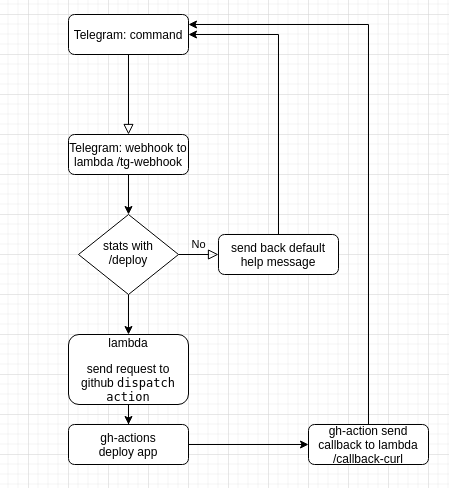

# devch2021

Try to deploy hallo-word lambda with git actions [here](https://t.me/devch2021_bot).

Fork me on [github](https://github.com/onemorebit/devch2021).

## Schema



## Preparation

- fork the repo.
- setup the shared AWS credentials with admin access (exported access/secret keys, aws_profile, IAM role, etc).

## Register a new Telegram bot

- go to the @BotFather
- register a new bot and get token to access the HTTP API
- create a new github repository secret `TELEBOT_SECRET` and fill it with the token

## Create a new Personal access tokens to run workflow_dispatch actions

- go to the `Developer settings` https://github.com/settings/tokens
- create Personal access token with access to `Full control of private repositories`
- create a new github repository secret `WF_DISPATCH_KEY` and fill it with the token

## Configuring OpenID Connect in Amazon Web Services

Update `GitHubOrg`, `RepositoryName` with you own forked repo values.

Set unique `S3BucketName`, and update `bot/samconfig.toml` and `app/samconfig.toml` with the same value.

Deploy cloudformation template:

```shell
export AWS_PROFILE=your-aws-profile
aws cloudformation deploy --template-file provision/IAMRoleCFN.template  \
    --stack-name github-actions-oidc \
    --parameter-overrides \
                  GitHubOrg=onemorebit \
                  RepositoryName=devch2021 \
                  S3BucketName=devch2021-samclisourcebucket	\
    --capabilities CAPABILITY_IAM CAPABILITY_NAMED_IAM
```

Create a new github repository secret `AWS_ROLE_TO_ASSUME` with Role ARN value from CFN outputs:

```shell
aws cloudformation describe-stacks --stack-name github-actions-oidc --query 'Stacks[0].Outputs[?OutputKey==`Role`].OutputValue' --output text
# it looks like arn:aws:iam::123456789012:role/github-actions-oidc-Role-ABCD1234XZY	
```

## Deploy the bot

Push the changes to the forked repo.

The bot will be deployed to AWS, and will automatically register created webhook to Telegram.

